# データモデル設計（MVP）

> MVP のテーブル設計。決定事項を反映：
> - 食材マスタは **地域非依存 ID** 中心（Phase2 で Spoonacular 採用前提）
> - **匿名 ID → アカウント** マージ可能な構造
> - **採用ログを構造化保存**（Phase2 で自前レシピ DB Layer B 化の素地）
> - **栄養値はシステム側で再計算**（文科省成分表）
> - DB エンジンは未確定だが、PostgreSQL を想定して書く（型・拡張機能の表現用）

## 1. 全体像（ER 概観）

```mermaid
erDiagram
    USERS ||--o| USER_PROFILES : has
    USERS ||--o{ USER_ALLERGIES : has
    USERS ||--o{ USER_PREFERENCE_TAGS : has
    USERS ||--o{ USER_DISLIKED_INGREDIENTS : has
    USERS ||--o{ INVENTORY_ITEMS : owns
    USERS ||--o{ PROPOSALS : requests
    USERS ||--o{ ADOPTIONS : adopts

    ALLERGENS ||--o{ USER_ALLERGIES : referenced
    ALLERGENS ||--o{ INGREDIENT_ALLERGENS : referenced

    INGREDIENTS ||--o{ INGREDIENT_LOCALIZATIONS : has
    INGREDIENTS ||--o{ INGREDIENT_ALIASES : has
    INGREDIENTS ||--o{ INGREDIENT_ALLERGENS : has
    INGREDIENTS ||--o{ INGREDIENT_UNIT_CONVERSIONS : has
    INGREDIENTS ||--o{ INGREDIENT_NUTRIENT_VALUES : has
    INGREDIENTS ||--o{ USER_DISLIKED_INGREDIENTS : referenced
    INGREDIENTS ||--o{ INVENTORY_ITEMS : referenced
    INGREDIENTS ||--o{ RECIPE_INGREDIENTS : referenced

    UNITS ||--o{ INVENTORY_ITEMS : measured_by
    UNITS ||--o{ RECIPE_INGREDIENTS : measured_by
    UNITS ||--o{ INGREDIENT_UNIT_CONVERSIONS : referenced

    NUTRIENTS ||--o{ INGREDIENT_NUTRIENT_VALUES : referenced
    NUTRIENTS ||--o{ RECIPE_NUTRIENT_VALUES : referenced

    RECIPES ||--o{ RECIPE_INGREDIENTS : composed_of
    RECIPES ||--o{ RECIPE_NUTRIENT_VALUES : has
    RECIPES ||--o{ RECIPE_TAGS : tagged
    RECIPES ||--o{ PROPOSAL_CANDIDATES : suggested_as
    RECIPES ||--o{ ADOPTIONS : adopted_as

    PROPOSALS ||--o{ PROPOSAL_CANDIDATES : contains
    PROPOSALS ||--o| ADOPTIONS : results_in

    ADOPTIONS ||--o{ ADOPTION_INVENTORY_USES : consumes
    INVENTORY_ITEMS ||--o{ ADOPTION_INVENTORY_USES : referenced
```



## 2. ドメイン別テーブル定義

### 2.1 User & Profile

#### `users`
匿名 ID を主キーに据え、Phase2 のアカウント機能では `account_id` を後付け。

| カラム | 型 | 説明 |
|---|---|---|
| `id` | UUID PK | = 匿名 ID。端末で生成しサーバに同期 |
| `account_id` | UUID NULL | Phase2 でアカウント発行時に紐付け。NULL = 未ログイン |
| `locale` | TEXT | `ja-JP` 等 |
| `region` | TEXT | `JP` 等。地域別 API/成分表の切替に使う |
| `created_at` | TIMESTAMPTZ | |
| `last_active_at` | TIMESTAMPTZ | |

**インデックス**: `account_id`（NULL 許容）, `last_active_at`

#### `user_profiles`
| カラム | 型 | 説明 |
|---|---|---|
| `user_id` | UUID PK FK→users | |
| `household_adults` | INT | 大人の人数 |
| `household_children` | INT | 子供の人数 |
| `updated_at` | TIMESTAMPTZ | |

> 持病・カロリー目標・宗教制限・家族メンバー別は Phase2。MVP では人数のみ。

#### `user_allergies` （ハード制約）
| カラム | 型 | 説明 |
|---|---|---|
| `user_id` | UUID FK | |
| `allergen_id` | INT FK→allergens | |
| `severity` | TEXT | `avoid`/`strict`。MVP は `strict` 固定でも可 |
| PK | (user_id, allergen_id) | |

#### `user_preference_tags` （ソフト制約：好きな系統）
| カラム | 型 | 説明 |
|---|---|---|
| `user_id` | UUID FK | |
| `tag` | TEXT | `washoku`, `chuka`, `italian`, ... |
| `weight` | SMALLINT | -1（嫌い）〜 +2（大好き）。MVP は +1 固定でも可 |
| PK | (user_id, tag) | |

#### `user_disliked_ingredients`
| カラム | 型 | 説明 |
|---|---|---|
| `user_id` | UUID FK | |
| `ingredient_id` | UUID FK→ingredients | |
| `note` | TEXT NULL | |
| PK | (user_id, ingredient_id) | |

---

### 2.2 Ingredient Master（地域非依存 ID）

#### `ingredients`
**`id` は地域非依存の正規 ID**。表示名は別テーブルで多言語化。

| カラム | 型 | 説明 |
|---|---|---|
| `id` | UUID PK | canonical_id |
| `slug` | TEXT UNIQUE | 開発用の識別子（例：`egg`, `milk`, `tomato`） |
| `category` | TEXT | `protein`/`vegetable`/`dairy`/... |
| `base_unit_id` | INT FK→units | 内部正規化に使う単位（`g` または `ml` または `piece`） |
| `external_refs` | JSONB | `{"mext_food_id": "...", "spoonacular_id": ...}` 地域別 DB との紐付け |
| `created_at` | TIMESTAMPTZ | |

> MVP では `external_refs.mext_food_id` を必ず埋める（栄養計算のため）。
> `spoonacular_id` は Phase2 で順次埋める。

#### `ingredient_localizations`
| カラム | 型 | 説明 |
|---|---|---|
| `ingredient_id` | UUID FK | |
| `locale` | TEXT | `ja-JP`, `en-US`, ... |
| `display_name` | TEXT | UI 表示名 |
| `description` | TEXT NULL | |
| PK | (ingredient_id, locale) | |

#### `ingredient_aliases`
検索・自然言語入力からのマッチ用。
| カラム | 型 | 説明 |
|---|---|---|
| `ingredient_id` | UUID FK | |
| `locale` | TEXT | |
| `alias` | TEXT | 「たまご」「玉子」「鶏卵」など |
| PK | (ingredient_id, locale, alias) | |

#### `ingredient_allergens`
| カラム | 型 | 説明 |
|---|---|---|
| `ingredient_id` | UUID FK | |
| `allergen_id` | INT FK→allergens | |
| PK | (ingredient_id, allergen_id) | |

#### `ingredient_unit_conversions`
食材ごとの単位換算（卵 1個 ≈ 60g 等）。
| カラム | 型 | 説明 |
|---|---|---|
| `ingredient_id` | UUID FK | |
| `unit_id` | INT FK→units | |
| `factor_to_base` | NUMERIC | base_unit に対する換算係数。例：卵の base=`g`、unit=`piece`、factor=60 |
| PK | (ingredient_id, unit_id) | |

> 普遍的な換算（1 cup = 240 ml 等）は `unit_conversions_global` に置く案もあるが、MVP では食材依存・非依存をまとめてこのテーブルで扱う。

#### `ingredient_nutrient_values`
| カラム | 型 | 説明 |
|---|---|---|
| `ingredient_id` | UUID FK | |
| `nutrient_id` | INT FK→nutrients | |
| `value_per_100_base` | NUMERIC | base_unit 100 単位あたりの量 |
| `source` | TEXT | `mext_8th_2023` 等 |
| PK | (ingredient_id, nutrient_id, source) | |

---

### 2.3 Master Tables

#### `allergens`
| カラム | 型 | 説明 |
|---|---|---|
| `id` | INT PK | |
| `code` | TEXT UNIQUE | `egg`, `milk`, `wheat`, `buckwheat`, `peanut`, `shrimp`, `crab`, ... |
| `label_ja` | TEXT | |
| `label_en` | TEXT | |

#### `nutrients`
| カラム | 型 | 説明 |
|---|---|---|
| `id` | INT PK | |
| `code` | TEXT UNIQUE | `energy_kcal`, `protein_g`, `fat_g`, `carb_g`, `sodium_mg`, `potassium_mg`, ... |
| `label_ja` | TEXT | |
| `unit` | TEXT | `kcal`, `g`, `mg` |

> MVP では「カロリー・三大栄養素・Na」程度に絞る。Phase2 で持病対応用に拡張（K, P, GI 等）。

#### `units`
| カラム | 型 | 説明 |
|---|---|---|
| `id` | INT PK | |
| `code` | TEXT UNIQUE | `g`, `kg`, `ml`, `l`, `piece`, `pack`, `tbsp`, `tsp`, `cup` |
| `label_ja` | TEXT | |
| `kind` | TEXT | `mass` / `volume` / `count` |

---

### 2.4 Inventory（在庫）

#### `inventory_items`
| カラム | 型 | 説明 |
|---|---|---|
| `id` | UUID PK | |
| `user_id` | UUID FK | |
| `ingredient_id` | UUID FK | |
| `quantity` | NUMERIC | 表示用数量（ユーザー入力） |
| `unit_id` | INT FK→units | 表示用単位 |
| `base_quantity` | NUMERIC | 内部正規化済み（base_unit ベース）。`quantity * factor_to_base` で算出 |
| `storage_location` | TEXT | `fridge` / `freezer` / `pantry` |
| `expires_at` | DATE NULL | |
| `expires_type` | TEXT NULL | `best_before`（賞味）/ `use_by`（消費） |
| `note` | TEXT NULL | |
| `created_at` | TIMESTAMPTZ | |
| `updated_at` | TIMESTAMPTZ | |

> 例：「牛乳 500ml × 2 パック」は 1 行で `quantity=2, unit=pack, base_quantity=1000` を保存。

**インデックス**: `(user_id, storage_location)`, `(user_id, expires_at)`

---

### 2.5 Recipe

#### `recipes`
| カラム | 型 | 説明 |
|---|---|---|
| `id` | UUID PK | |
| `source_type` | TEXT | `rakuten` / `ai_generated` / `user_created`（Phase2: `self_db`, `brave_search`） |
| `external_id` | TEXT NULL | 楽天レシピの recipeId 等 |
| `attribution_url` | TEXT NULL | 出典 URL（楽天用） |
| `attribution_label` | TEXT NULL | UI バッジ用文字列 |
| `title` | TEXT | |
| `locale` | TEXT | `ja-JP` |
| `servings_default` | SMALLINT | レシピ既定の人数 |
| `total_cook_minutes` | SMALLINT NULL | |
| `instructions` | TEXT | 手順本文（Markdown） |
| `created_by_user_id` | UUID NULL | AI 生成のトリガーになったユーザー（採用ログ Layer B 化の素地） |
| `created_at` | TIMESTAMPTZ | |

> `external_id` がある場合は `(source_type, external_id)` UNIQUE。
> 同一 AI 生成レシピの dedupe は MVP では不要（採用された生成レシピだけ残し、それ以外は永続化しなくても可）。

#### `recipe_ingredients`
| カラム | 型 | 説明 |
|---|---|---|
| `recipe_id` | UUID FK | |
| `ingredient_id` | UUID FK | |
| `quantity` | NUMERIC | レシピ既定 servings に対する分量 |
| `unit_id` | INT FK→units | |
| `is_optional` | BOOLEAN | |
| `display_text` | TEXT NULL | 「お好みで適量」など正規化できない記述 |
| PK | (recipe_id, ingredient_id, unit_id) | |

#### `recipe_nutrient_values`
**システムが計算した正**。AI が出した数値は保存しない。
| カラム | 型 | 説明 |
|---|---|---|
| `recipe_id` | UUID FK | |
| `nutrient_id` | INT FK | |
| `value_per_serving` | NUMERIC | |
| `calculated_at` | TIMESTAMPTZ | |
| PK | (recipe_id, nutrient_id) | |

#### `recipe_tags`
| カラム | 型 | 説明 |
|---|---|---|
| `recipe_id` | UUID FK | |
| `tag` | TEXT | `washoku`, `chuka`, ... `user_preference_tags.tag` と同じ語彙 |
| PK | (recipe_id, tag) | |

---

### 2.6 Proposal & Adoption

#### `proposals`
献立提案の 1 回分（候補 3 つを内包）。
| カラム | 型 | 説明 |
|---|---|---|
| `id` | UUID PK | |
| `user_id` | UUID FK | |
| `requested_at` | TIMESTAMPTZ | |
| `context_snapshot` | JSONB | 提案時のスナップショット（人数・アレルギー・在庫サマリ・履歴 N 日分のレシピ ID 等）。再現性とデバッグ用 |
| `model_meta` | JSONB | 使用した Bedrock モデル名・温度・トークン数等 |

#### `proposal_candidates`
| カラム | 型 | 説明 |
|---|---|---|
| `id` | UUID PK | |
| `proposal_id` | UUID FK | |
| `recipe_id` | UUID FK NULL | 楽天 API 由来は `recipes` 既存 ID。AI 生成は採用前は NULL |
| `recipe_snapshot` | JSONB NULL | AI 生成レシピの未永続化スナップショット（title/instructions/ingredients/source_meta）。採用時にこれを `recipes` 一式へ展開 |
| `rank` | SMALLINT | 1〜3 |
| `score` | NUMERIC | システム側スコア（在庫マッチ＋期限優先＋偏り回避） |
| `reason_text` | TEXT | Bedrock が生成した「なぜこれを勧めるか」の説明 |
| `missing_ingredients` | JSONB | 不足材料リスト（UI 表示用） |

> **制約**: `recipe_id IS NOT NULL OR recipe_snapshot IS NOT NULL`（CHECK 制約で表現）

#### `adoptions`
| カラム | 型 | 説明 |
|---|---|---|
| `id` | UUID PK | |
| `user_id` | UUID FK | |
| `proposal_id` | UUID FK NULL | プロポーザル経由でなく自由に料理した場合は NULL |
| `recipe_id` | UUID FK | |
| `adopted_at` | TIMESTAMPTZ | |
| `servings` | NUMERIC | 実際に作った人数 |
| `note` | TEXT NULL | |

**インデックス**: `(user_id, adopted_at DESC)` ← 履歴 N 日参照に効く

#### `adoption_inventory_uses`
| カラム | 型 | 説明 |
|---|---|---|
| `adoption_id` | UUID FK | |
| `inventory_item_id` | UUID FK | |
| `used_quantity` | NUMERIC | 表示単位での使用量 |
| `used_unit_id` | INT FK | |
| `used_base_quantity` | NUMERIC | 正規化後の使用量。`inventory_items.base_quantity` を減算するソース |
| PK | (adoption_id, inventory_item_id) | |

---

## 3. 主要フロー

### 3.1 在庫追加
1. ユーザーが食材を選択（マスタ検索／別名一致／無ければ新規 ingredients を生成）
2. 数量・単位・期限・保管場所を入力
3. `base_quantity = quantity × factor_to_base` を計算して保存

### 3.2 献立提案（UC-2）
```
1. ハード制約取得: user_allergies, user_disliked_ingredients
2. 在庫スナップショット: inventory_items WHERE user_id=?
3. 履歴取得: adoptions JOIN recipes WHERE adopted_at >= now() - N days
4. 候補プール構築:
   a) 楽天 API: カテゴリ別ランキングから取得し、その場で正規化してレシピ候補化
   b) Bedrock: 在庫＋履歴＋好みを渡して新規レシピを生成
5. ハードフィルタ: allergen を含むレシピを除外、嫌い食材を含むレシピを除外
6. スコアリング: 在庫マッチ率＋期限近接＋履歴非重複＋好みタグ加点
7. 栄養計算: recipe_ingredients を base_unit に正規化 → ingredient_nutrient_values で集計 → servings 比で per_serving 算出 → recipe_nutrient_values に保存
8. Bedrock 最終選定: 上位 5〜10 候補を渡し、3 つを選んで理由付け
9. proposals / proposal_candidates に保存して返す
```

### 3.3 採用 → 在庫減算（UC-3）
```
1. ユーザーが候補を選択 → adoptions 作成
2. recipe_ingredients × (adopted_servings / servings_default) で必要量算出
3. 使用する inventory_items を選び adoption_inventory_uses に記録
4. inventory_items.base_quantity を used_base_quantity 分減算
5. base_quantity <= 0 になったアイテムは UI 上「使い切り」扱い（行は削除せずフラグ管理しても可）
```

### 3.4 栄養計算（決定論パス）
```
recipe.nutrient[N] per_serving =
  Σ (recipe_ingredients[i].quantity × factor_to_base[i]
       × ingredient_nutrient_values[i][N].value_per_100_base / 100)
  / recipe.servings_default
```
※ AI が出した数値は信用しない。生成後に必ずこの式で再計算して `recipe_nutrient_values` に保存。

---

## 4. 設計上の重要パターン

### 4.1 地域非依存 ID
- `ingredients.id` は完全に地域非依存
- 地域別の付随情報は次の 3 つに分散：
  - 表示名 → `ingredient_localizations`
  - 別名/検索語 → `ingredient_aliases`
  - 外部 DB との紐付け → `ingredients.external_refs`（JSONB）
- Phase2 で Spoonacular を入れる時は `external_refs.spoonacular_id` を埋めるだけ

### 4.2 匿名 → アカウントマージ
- 全テーブルが `user_id` を見る。`user_id` 自体は変えない
- アカウント発行時：`users.account_id` を埋めるだけで既存データは無修正
- 複数端末を 1 アカウントに束ねる時：
  - 端末 A の `user_id` と端末 B の `user_id` の関係テーブルを後付け
  - もしくは「正のユーザー」に統合（移行ジョブを Phase2 で実装）

### 4.3 採用ログ → Layer B 化の素地
- `adoptions` × `recipes`（特に `source_type='ai_generated'`）の組み合わせが、Phase2 で自前レシピ DB（Layer B）の中身になる
- MVP の時点で `recipes.created_by_user_id` を残しておくことで、Phase2 で「他ユーザーにも見せて良いか」判定の起点にできる

### 4.4 在庫の二重持ち（quantity / base_quantity）
- 表示用：ユーザーの入力どおり（`quantity=2, unit=pack`）
- 計算用：base_unit に正規化（`base_quantity=1000`、base_unit=`ml`）
- 単位の異なる消費（例：「100ml 使った」）でも base_quantity で減算するため計算がブレない

---

## 5. MVP で省くもの（Phase2 以降の追加候補）

| テーブル/カラム | 何を持たせるか |
|---|---|
| `accounts` | Email/外部 ID/作成日 |
| `user_diseases` | 持病コード（減塩・糖質制限・腎臓病食）と禁忌ルールへの参照 |
| `family_members` | 家族個人ごとの好み・アレルギー・カロリー目標 |
| `user_calorie_targets` | 日次目標と実績集計 |
| `shopping_list_items` | 不足材料の自動収集 |
| `inventory_consumption_log` | 使い切り/廃棄/期限切れ等の追跡（栄養履歴の正確性向上） |
| `recipe_appliances` | 必要な調理器具 |
| `recipes.scene` | 朝/昼/夕/弁当/来客 |
| `recipes.season` | 旬の食材タグ |
| `external_recipe_sources` | Brave 検索結果のキャッシュ |
| `ingredient_localizations` の en-US 等 | グローバル展開 |

---

## 6. 決定事項（2026-05-25）

| 論点 | 決定 | 含意 |
|---|---|---|
| AI 生成レシピの永続化方針 | **採用されたものだけ `recipes` に保存** | 不採用の生成は `proposal_candidates` に提案メタとして残すのみ。DB 肥大を防ぎつつ Layer B 化の素地は確保 |
| 食材マスタの初期データ規模 | **文科省成分表の全 2,538 食材を一括取込** | seed スクリプトで一度に投入。MVP 途中でマスタ追加運用に手を取られない |
| 楽天 API のキャッシュ期間 | **24 時間** | バックグラウンドで日次バッチ。API コール数を抑制しつつランキングの鮮度を保つ |

### 6.1 永続化方針の詳細

```
提案フロー:
  Bedrock 生成 → proposal_candidates に「未永続化レシピ」として保持
                  （recipe フィールドは JSONB で簡易保存、recipes には INSERT しない）

採用フロー:
  ユーザーが採用 → その候補だけ recipes に INSERT
                  recipe_ingredients も同時に作成
                  栄養計算してrecipe_nutrient_values にも保存
                  adoptions が新規 recipe を参照
```

これに伴うスキーマ変更：
- `proposal_candidates.recipe_id` を **NULL 許容**にし、`proposal_candidates.recipe_snapshot` JSONB を追加
- 採用時に `recipe_snapshot` から `recipes` 一式を構築

### 6.2 食材マスタ取込の進め方

- データ元：文科省 八訂増補2023 Excel
- 取込スクリプト：
  1. Excel から食材 ID・名称・成分値をパース
  2. `ingredients` に slug / category / base_unit を付与して INSERT
  3. `ingredient_localizations` の `ja-JP` を埋める
  4. `ingredient_nutrient_values` に成分値（per 100g）を投入、`source='mext_8th_2023'`
  5. `ingredient_aliases` は別途、よくある呼称（「たまご」「玉子」等）を手動シード
- 出典クレジット：UI のフッタ等に「栄養成分: 文部科学省 日本食品標準成分表（八訂）増補2023」

### 6.3 楽天 API キャッシュ設計

- バッチ：日次（cron / EventBridge）でカテゴリ一覧 → 各カテゴリのランキング 4 件を取得
- 保存：`recipes` テーブルに `source_type='rakuten', external_id=<recipeId>` で UPSERT
- 取得タイミング：日本時間で「ユーザー利用が少ない時間帯」（午前 3 時等）
- レート制御：1 リクエスト 1 秒以上の間隔（楽天規約）

---

## 7. 残るオープン論点（実装フェーズで確定）

- **DB エンジン**: PostgreSQL / DynamoDB / Aurora Serverless v2 のどれか → 次の「C. 技術スタック選定」で確定
- **JSONB の使いどころ**: PostgreSQL 前提なら `context_snapshot`, `external_refs`, `recipe_snapshot` などで活躍。DynamoDB の場合はテーブル設計から変わる
- **Bedrock モデル選定**: Claude Opus / Sonnet / Haiku のどれを軸にするか（コスト×品質）
